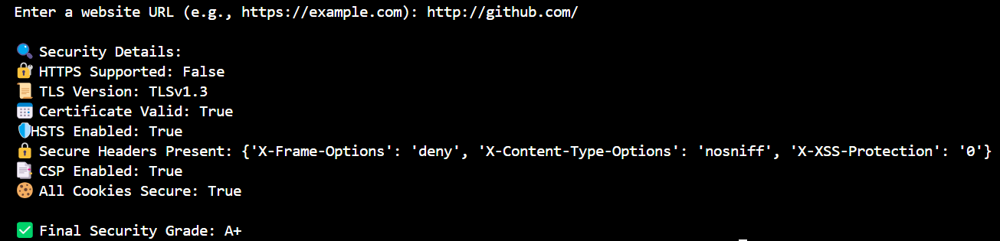

# 🔐 Website Security Grader

**Website Security Grader** is a Python-based tool that analyzes the **security posture of any website**. It evaluates key parameters like HTTPS support, TLS configuration, SSL certificate, secure headers, secure cookies, and more — then assigns a **Security Grade (A+ to D)** based on industry-standard best practices.

---

## 📺 Screenshot

👉 

---

## 🚀 Features

- ✅ Check if the website uses HTTPS  
- 🔒 Analyze TLS version (TLSv1.2, TLSv1.3, etc.)  
- 📜 Inspect SSL/TLS Certificate details  
- 📅 Validate Certificate expiration  
- 🛡️ Detect HTTP Strict Transport Security (HSTS)  
- 🔐 Check for Secure Cookies  
- 📦 Inspect Security Headers:
  - `X-Frame-Options`
  - `X-Content-Type-Options`
  - `X-XSS-Protection`
- 🧠 Check for Content Security Policy (CSP)
- 📈 Assign final security grade (A+ to D)

---

## Tech Stack

- Python 3
- ssl, socket
- cryptography
- requests
- http.client

---

## Grading Criteria

- HTTPS Support	                     -->   +2
- TLS v1.2 or v1.3	                 -->   +2
- Valid SSL Certificate	             -->   +2
- HSTS Enabled	                     -->   +2
- Security Headers Present	         -->   +2
- Content Security Policy Present	   -->   +2
- Secure Cookies	                   -->   +2

**Score → Grade Mapping:**
- ≥ 12	-->  A+
- ≥ 10	-->  A
- ≥ 8	  -->  B
- ≥ 6	  -->  C
- < 6	  -->  D

---

## Run the Project

``python main.py``

**Enter Website URL**

``Enter website URL: https://example.com`` 

## Author 
- Tirthraj Bhalodiya
- tirthrajbhalodiya2003@gmail.com
- [LinkedIn](https://www.linkedin.com/in/tirthraj-bhalodiya-97534b227/)
